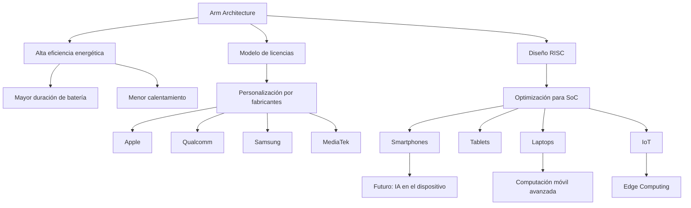

 Ingeniería en sistemas computacionales

 Materia: Lenguaje de interfaz

 Camarillo Molina Cristian

 Horario: 5pm 

Arm y el futuro de la computacion movil avanzada 

## Introducción
La computación móvil ha evolucionado rápidamente en las últimas décadas, y uno de los actores más importantes en esta transformación es Arm. Su arquitectura de procesadores se ha convertido en la base tecnológica de la mayoría de los dispositivos móviles modernos.

## ¿Qué es Arm?
Arm es una empresa británica que diseña arquitecturas de procesadores basadas en el modelo RISC (Reduced Instruction Set Computing). A diferencia de empresas como Intel y AMD, que fabrican y venden sus propios chips, Arm licencia sus diseños a otras compañías,

Esto permite que empresas como:
- Apple
- Qualcomm
- Samsung Electronics
- MetiaTek
desarrollen procesadores personalizados basados en la arquitectura Arm.

## ¿Por qué Arm domina la computación móvil?
### Arm y su ventaja estructural
El dominio de Arm en la computación móvil no es casualidad. Es el resultado de decisiones de diseño arquitectónico, modelo de negocio y adaptación al mercado móvil desde sus inicios.

## Arquitectura RISC
Arm se basa en la arquitectura RISC

### ¿Qué significa esto?
- Instrucciones más simples
- Menos ciclos por instrucción
- Menor consumo energético
- Diseño más eficiente

En dispositivos móviles, donde la batería es limitada, la efiuciencia energética es más importante que la potencia bruta.

Mientras que arquitecturas tradicionales como las usadas por Intel 6estaban pensadas originalmente pata computadoras de escritorio ( alto rendimiento, mayor consumo), Arm fue diseñada desde el inicio para sistemas embebidos y dispositivos de bajo consumo.

## Consumo energético extremadamente bajo
En un smartphone: 
- CPU
- GPU
- 5G
- Pantalla
- Sensores
  
Todo consume energía.

Arm optimiza:
- Estados de reposo avanzados
- Núcleos de alto rendimiento + núcleos eficientes
- Gestión inteligente de energía
  
Lo que permite:

- Mayor duración de la batería
- Menos calentamiento
- Dispositivos más delgados (Menos necesidad de refrigeración)

# Tabla resumen: Arm y el futuro de la computación móvil avanzada

| Categoría | Descripción | Impacto en la Computación Móvil |
|------------|-------------|----------------------------------|
| ¿Qué es Arm? | Empresa británica que diseña arquitecturas de procesadores basadas en RISC y licencia sus diseños. | Permite que múltiples fabricantes desarrollen chips personalizados. |
| Modelo de negocio | Licenciamiento de arquitectura en lugar de fabricación directa de chips. | Fomenta innovación y competencia entre fabricantes. |
| Empresas que usan Arm | Apple, Qualcomm, Samsung Electronics, MediaTek | Desarrollo de SoC personalizados para smartphones, tablets y laptops. |
| Arquitectura | RISC (Reduced Instruction Set Computing) | Instrucciones simples y eficientes. |
| Ventajas de RISC | - Instrucciones más simples - Menos ciclos por instrucción - Menor consumo energético - Diseño eficiente | Mejor rendimiento por watt y mayor eficiencia energética. |
| Diferencia con x86 (Intel/AMD) | x86 fue diseñada para escritorio (alto rendimiento, mayor consumo). Arm fue diseñada para bajo consumo y sistemas embebidos. | Mayor duración de batería en dispositivos móviles. |
| Optimización energética | - Estados de reposo avanzados - Núcleos de alto rendimiento + núcleos eficientes - Gestión inteligente de energía | Menor calentamiento y dispositivos más delgados. |
| Dispositivos donde se usa | Smartphones, Tablets, Laptops, IoT | Dominio en computación móvil y expansión hacia edge computing. |
| Futuro de Arm | Integración de IA en el dispositivo, edge computing y computación móvil avanzada | Mayor autonomía, procesamiento local y eficiencia energética. |
---

## Conclusión 
El liderazgo de Arm en la computación móvil avanzada no es casualidad. Su enfoque en la eficiencia energética, desde el diseño mismo de su arquitectura, le permitió adaptarse perfectamente a las necesidades de los dispositivos móviles. En un entorno donde la duración de batería y el rendimiento equilibrado son fundamentales, esta ventaja ha sido decisiva.

Además, su modelo de licencias ha fomentado la innovación, permitiendo que distintos fabricantes desarrollen soluciones personalizadas sin abandonar la misma base tecnológica. Con la creciente integración de inteligencia artificial y el avance hacia dispositivos más potentes y eficientes, todo indica que Arm seguirá siendo un pilar clave en el futuro de la computación móvil.

### Fuentes
[Arm y su arquitectura](https://dredu.mx/principal/intereses/aficiones/computadoras-y-dispositivos-de-procesamiento-de-datos/arquitecturas-de-computo/arquitecturas-arm)

[Arm en dispositivos móviles y rendimiento](https://www.arm.com/markets/mobile-computing)

[Chips Arm](https://www.aeanet.org/what-is-an-arm-chip)
